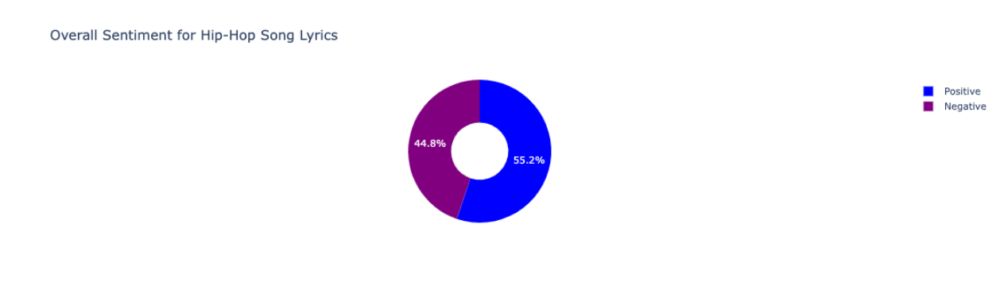
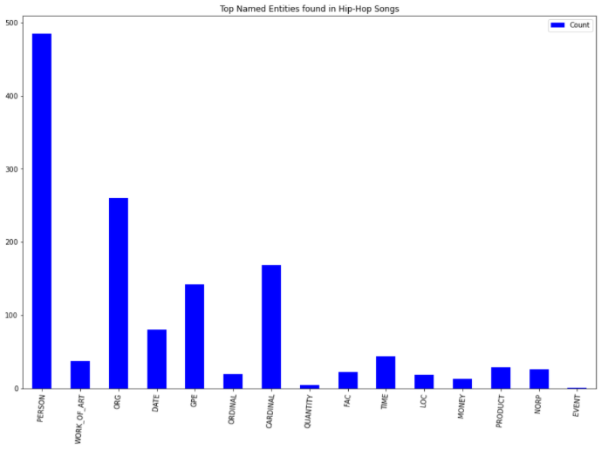
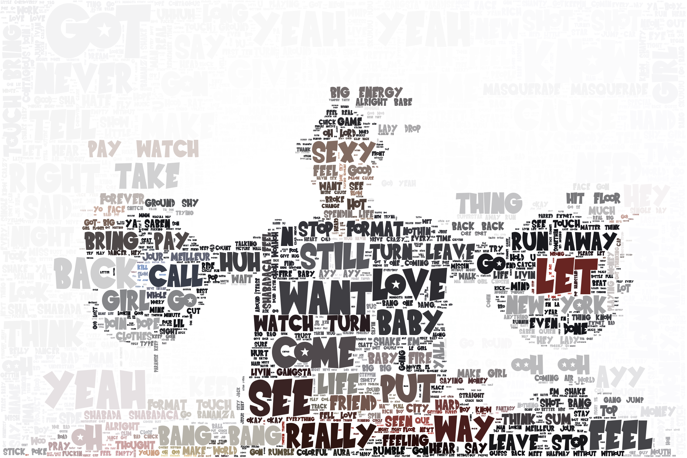
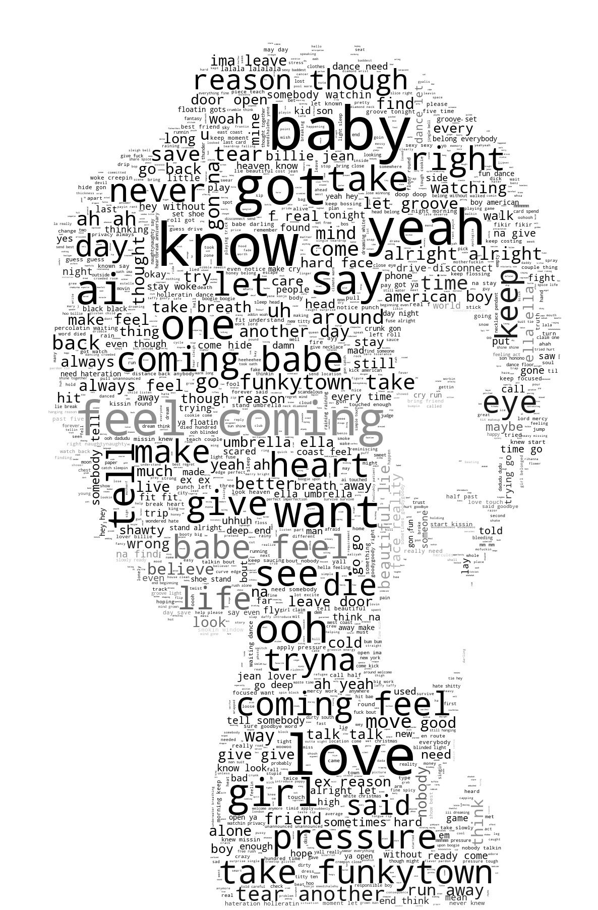

# Project Title

(project image)

(summary of project bla bla)

# Notebooks

Access the genre of choice for notebook containing analysis:

[Country](country_nb/country_data.ipynb)

EDM

[Hip Hop](hiphop_rnb_data/hiphopraplyrics.ipynb)

Rock

[RnB](hiphop_rnb_data/rnblyrics.ipynb)

# Natural Language Processing

## Data Preprocessing

### Data Acquisition

We obtained our lyric data from [Shazam Core API](https://rapidapi.com/tipsters/api/shazam-core/) at [RapidAPI.com](https://rapidapi.com/hub)

The specific API endpoints used were:

### Genre Top Song Charts

## Sentiment Analysis

## Ngrams and Frequency Analysis

### Top Word Frequency Analysis

## Name entity recognition

## Word clouds

### Country

### Hip Hop

### RnB

## Next Word Prediction

- Next word prediction algorithm using the music data from a specific genre, using the following:
    - Markov Chains
    - Kneser Ney Interpolated algorithm
    

---

### Miami FinTech Bootcamp 2021-2022

#### Monique Ferguson, Andrew Hidalgo, Frank Lau and Marcela Castaño