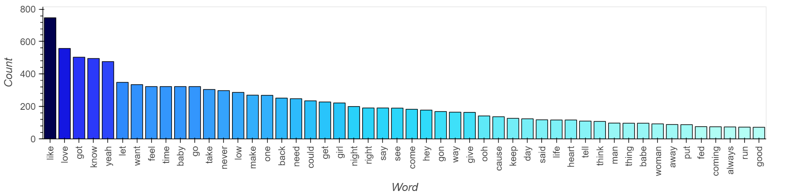

# NLP & Machine Music

# Objectives

- Analyze lyric data with Natural Language Processing techniques
    - Tokenization
    - Sentiment analysis
    - N-grams, frequency analysis
    - Named entity recognition
- Become familiar with text prediction algorithms using machine learning
- Explore text prediction methodologies

# Notebooks

Access the genre of choice for notebook containing analysis:

[Country](country_nb/country_data.ipynb)

[EDM](edm_nb/edm3.ipynb)

[Hip Hop](hiphop_rnb_data/hiphopraplyrics.ipynb)

[Rock](rock_nb/rock_data.ipynb)

[RnB](hiphop_rnb_data/rnblyrics.ipynb)

[POP](hiphop_rnb_data/poplyrics.ipynb)

To view the summary for all genres, check out:

[Visualizations for All Genres](all_genres/all_genres_nb.ipynb)

# Predictive Models

- We carried out next word prediction algorithm using the music data from a specific genre, using the following:
    - Markov Chains
    - Maximum Likelihood Estimator Algorithm

## Markov Chains: Randomized text prediction

A Markov chain is a stochastic technique, but it differs from a general stochastic technique in that a Markov chain must be "memory-less." That is, (the probability of) future actions are not dependent upon the steps that led up to the present state. This is called the Markov property. [^1]

For more details, we recommend the following [video](https://www.youtube.com/watch?v=MGVdu39gT6k&t=394s&ab_channel=ADashofData).

## Language models with NLTK

For further reading, consider this [Medium Article](https://medium.com/swlh/language-modelling-with-nltk-20eac7e70853).

Also refer to the [MLE documentation](https://www.nltk.org/api/nltk.lm.html).

## Maximum Likelihood Estimator from NLTK

This [article](https://www.kaggle.com/alvations/n-gram-language-model-with-nltk/notebook) served as a starting point to our endeavor in text prediction.

Check out the [Language Model Module](https://www.nltk.org/api/nltk.lm.html) from NTLK for more information on the different models to choose from.

# Natural Language Processing

## Data Preprocessing

We obtained our lyric data from [Shazam Core API](https://rapidapi.com/tipsters/api/shazam-core/) at [RapidAPI.com](https://rapidapi.com/hub)

The specific API endpoints used were:

- **@ World Chart by Genre** endpoint: 
    - feed a genre and the limit number of songs to retrieve
    - obtain top chart for genre with trackID, artist, song name

- **@Track Details** endpoint:
    - feed trackID
    - obtain lyrics for song

We then generated a dataframe with the lyrics and dropped any chart songs for which lyrics could not be obtained through the API.

### Genre Top Song Charts

## Sentiment Analysis

## Ngrams and Frequency Analysis

### Top Word Frequency Analysis

## Named Entity Recognition

## Word Clouds

### Country

### EDM

### Hip Hop

### RnB

### POP

### Rock

## Next Word Prediction

We used Google's Text-To-Speech library to generate mp4 files of our Markov Chains and AI generated lyrics. 

### Here is a look at our code with Markov Chains

### Here is a look at our code with Maximum Likelihood Estimator

Here are lyric snippets for each genre:

### Snippet of Country MLE Algorithm
https://user-images.githubusercontent.com/88758706/147867791-15da3590-8103-4dcc-8985-bb47984f72ad.mp4

### Snippet of EDM MLE Algorithm
https://user-images.githubusercontent.com/88758706/147998783-cf94e0ca-1ecc-458b-afba-5ed73c1e9237.mp4

### Snippet of Hip Hop Markov
https://user-images.githubusercontent.com/78571802/147998097-49ba5026-94dd-4478-94f8-34065f5601de.mp4

### Snippet of Hip Hop MLE Algorithm

https://user-images.githubusercontent.com/78571802/147998169-11a84032-4863-4f35-a7e1-63434e5df615.mp4

### Snippet of RnB Markov
https://user-images.githubusercontent.com/78571802/147998248-55b7fc05-d831-4fc8-82c4-36b73ca5e0b6.mp4

### Snippet of RnB MLE Algorithm
https://user-images.githubusercontent.com/78571802/147998991-dcebb568-14ed-433b-8bce-310863c86a1a.mp4

### Snippet of Pop Markov
https://user-images.githubusercontent.com/78571802/147999040-23548f23-577c-4792-980f-8c48bc1f1d18.mp4

### Snippet of Rock Markov
https://user-images.githubusercontent.com/86018812/148119641-90848fd8-6bd8-4d09-8b4a-1ccf039f0b4e.mp4

### Pop Text MLE Algorithm
https://user-images.githubusercontent.com/78571802/147999052-7a7eaa10-e389-4bdb-bf99-449a0c4c0fe0.mp4

### Snippet of Pop MLE Algorithm
https://user-images.githubusercontent.com/78571802/148133094-b3e24bdb-d81d-4384-857c-41e2964fb45f.mp4

### Model Scores

*MLE is an N-gram model Algorithm*

Some examples from the Country Lyrics Model:

The probability of 'woman' appearing in the text is: 0.00139

The probability of 'feel like' to be followed by 'a' is: 0.5

The probability of 'feel like a' to be followed by woman' is: 1.0

#### Perplexity

From the Country Lyrics Model:

The perplexity of 'aliens are' is: inf

The perplexity of 'old man' is: 7.667

The perplexity of 'bell rock' is: 3.4

The perplexity of 'jingle bell' is: 1.333

The perplexity of 'country boy' is: 1.273

Feel free to read up more on [Perplexity and Language Models](https://towardsdatascience.com/perplexity-in-language-models-87a196019a94) or watch this [video](https://www.youtube.com/watch?v=NCyCkgMLRiY&ab_channel=ArtificialIntelligence-AllinOne).

## Conclusions

### Summary of All Genres

Here are the overall results for the sentiment analysis:

### *VADER concluded that most of the top chart songs across genres were **Positive***

 

These are the most used words in the Top Chart Songs for the analyzed genres:

This is the word cloud for the most used words across genres:

### *'like', 'yeah', 'know', 'got' and 'love' are the most used words across all analyzed genres.*

 

These are the frequencies of each Named Entity found in the Top Chart Songs for all genres:

### *The main focus across the analyzed genres seems to be **people***

 

### Limitations

- Detokenizer: Returned text is readable, but lacking in punctuation and paragraph structure.

- NER: The Person and GPE Named entities were greatly mis-identified by the Spacy's NER. The image below is from the country dataset.

    

---

### Miami FinTech Bootcamp 2021-2022

#### Monique Ferguson, Andrew Hidalgo, Frank Lau and Marcela Castaño

[^1]: https://brilliant.org/wiki/markov-chains/
