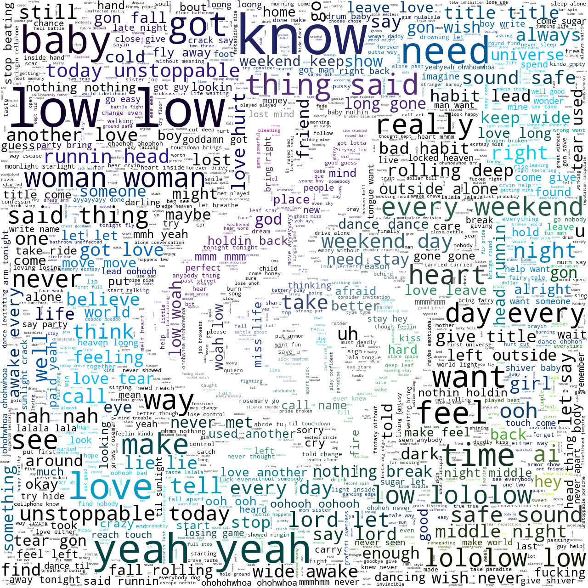

# Project Title

(project image)

# Objectives

- Analyze lyric data with Natural Language Processing techniques
    - Tokenization
    - Sentiment analysis
    - N-grams, frequency analysis
    - Name entity recognition
- Become familiar with text prediction algorithms using machine learning
- Explore text prediction methodologies

# Notebooks

Access the genre of choice for notebook containing analysis:

[Country](country_nb/country_data.ipynb)

[EDM](edm_nb/edm3.ipynb)

[Hip Hop](hiphop_rnb_data/hiphopraplyrics.ipynb)

Rock

[RnB](hiphop_rnb_data/rnblyrics.ipynb)

[POP](hiphop_rnb_data/poplyrics.ipynb)

# Predictive Models

- Markov Chains: Randomized text prediction

A Markov chain is a stochastic technique, but it differs from a general stochastic technique in that a Markov chain must be "memory-less." That is, (the probability of) future actions are not dependent upon the steps that led up to the present state. This is called the Markov property. While the theory of Markov chains is essential precisely because so many "everyday" processes satisfy the Markov property, there are many common examples of stochastic properties that do not meet the Markov property. [^1]

For more details, we recommend the following [video](https://www.youtube.com/watch?v=MGVdu39gT6k&t=394s&ab_channel=ADashofData)

- Language models with NLTK

For further reading, consider this [Medium Article](https://medium.com/swlh/language-modelling-with-nltk-20eac7e70853).

Also refer to the [MLE documentation](https://www.nltk.org/api/nltk.lm.html).

- Maximum Likelihood Estimator from NLTK
Check out this [article](https://www.nltk.org/api/nltk.lm.html) for more information on the MLE model.

# Natural Language Processing

## Data Preprocessing

### Data Acquisition

We obtained our lyric data from [Shazam Core API](https://rapidapi.com/tipsters/api/shazam-core/) at [RapidAPI.com](https://rapidapi.com/hub)

The specific API endpoints used were:

### Genre Top Song Charts

## Sentiment Analysis

## Ngrams and Frequency Analysis

### Top Word Frequency Analysis

## Name entity recognition

## Word clouds

### Country

### EDM

### Hip Hop

### RnB

### POP

## Next Word Prediction

- Next word prediction algorithm using the music data from a specific genre, using the following:
    - Markov Chains
    - Maximum Estimator Algorithm
    

### Snippet of Country MLE Algorithm
https://user-images.githubusercontent.com/88758706/147867791-15da3590-8103-4dcc-8985-bb47984f72ad.mp4

### AI Generated EDM Lyrics
https://github.com/laufrankb/MiamiFintechProject2/blob/9a8da13b8c942c8381ba97332591355d6a127f8f/edm_nb/mle_lyrics_EDM.mp4

### Snippet of Hip Hop Markov

https://user-images.githubusercontent.com/78571802/147998097-49ba5026-94dd-4478-94f8-34065f5601de.mp4

### Snippet of Hip Hop MLE Algorithm

https://user-images.githubusercontent.com/78571802/147998169-11a84032-4863-4f35-a7e1-63434e5df615.mp4

### Snippet of RnB Markov

https://user-images.githubusercontent.com/78571802/147998248-55b7fc05-d831-4fc8-82c4-36b73ca5e0b6.mp4

## Conclusions

### Summary of All Genres

---

### Miami FinTech Bootcamp 2021-2022

#### Monique Ferguson, Andrew Hidalgo, Frank Lau and Marcela Castaño

[^1]: https://brilliant.org/wiki/markov-chains/